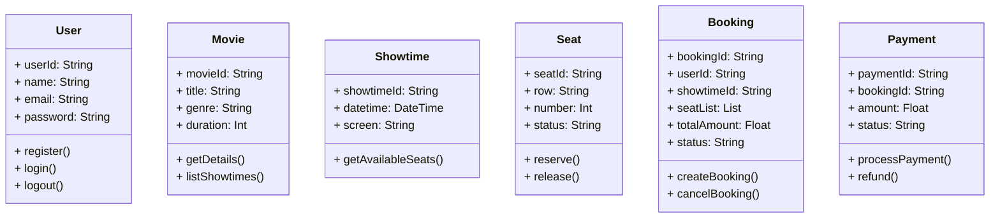

# GROUP 2: XÂY DỰNG GIAO DIỆN ỨNG DỤNG ĐẶT VÉ XEM PHIM 
## LINK FIGMA: https://www.figma.com/design/0YMDhNtTyNCacMMk3kaMf3/KTPM-LT8-GROUP2?node-id=0-1&t=x2y7rGnXjZ8FhG0L-1
## Giới Thiệu Dự Án
- Ứng dụng Đặt Vé Xem Phim là một giao diện người dùng thân thiện, hiện đại giúp người dùng dễ dàng tìm kiếm rạp chiếu phim, chọn suất chiếu, đặt vé và thanh toán nhanh chóng.
- Dự án này tập trung vào thiết kế giao diện người dùng (UI/UX) trên Figma nhằm mô phỏng trải nghiệm đặt vé trực tuyến như các ứng dụng phổ biến hiện nay.
## Giới thiệu thành viên:

| Thành viên nhóm       | Mã sinh viên | Email                         | Đóng góp |
|-----------------------|--------------|-------------------------------|----------|
| Nguyễn Tuấn Thành     | 23010626     | tuanthanh365bt@gmail.com | 110%     |
| Nguyễn Đăng Nhật      | 23010629     | nhattnguyenn2005@gmail.com  | 90%      |
| Nguyễn Huy Hoàng      | 23010143     | hoang20052810@gmail.com | 100%     |

## 1. Bảng phân chia công việc chi tiết theo tuần:
| Thành viên            | Tuần 1 (Phân tích yêu cầu)                                              | Tuần 2 (Thiết kế Use‑case & Flow)                                           | Tuần 3 (Thiết kế hướng đối tượng)                                                  | Tuần 4 (UI Flow & Prototype)                                   | Tuần 5 (Hoàn thiện & Đánh giá)                                                   |
|-----------------------|---------------------------------------------------------------------------|------------------------------------------------------------------------------|--------------------------------------------------------------------------------------|----------------------------------------------------------------|------------------------------------------------------------------------------------|
| **Nguyễn Tuấn Thành** | - Thu thập yêu cầu - Xác định actors & chức năng chính                 | - Phân tích chức năng theo actor - Vẽ Use‑case diagram - Mô tả chi tiết từng use‑case | - Xác định class chính và thuộc tính - Thiết kế quan hệ giữa các class (UML)     | - Liên kết màn hình, thiết lập điều hướng (Prototype)         | - Tổng hợp phản hồi - Chạy test UI flow - Ghi nhận và sửa lỗi trong prototype |
| **Nguyễn Huy Hoàng**  | - Nghiên cứu người dùng & kịch bản thực tế                                | - Chọn flow diagram (Sequence hoặc Activity) - Vẽ sơ đồ flow              | - Viết đặc tả phương thức các class (method signatures)                             | - Bố trí layout chính, style guide trên Figma                | - Đánh giá ưu/nhược điểm - Ghi nhận lỗi - Đề xuất cải tiến tính năng            |
| **Nguyễn Đăng Nhật**  | - Tham khảo ứng dụng tương tự - Soạn thảo đề bài toán                   | - Chuẩn hóa sơ đồ Use‑case                                                    | - Chuẩn hóa sơ đồ Class                                                              | - Vẽ UI flow diagram (Wireflow)                              | - Viết phần đánh giá - Báo cáo kết quả                                            |
## 2. Phân tích yêu cầu:
### 2.1. Đặt vấn đề bài toán
Trong bối cảnh nhu cầu giải trí trực tuyến ngày càng cao, việc phát triển một ứng dụng đặt vé xem phim tiện lợi, trực quan và nhanh chóng là thiết yếu. Hệ thống của nhóm chúng tôi cho phép người dùng:
-	Đăng ký / Đăng nhập,
-	Xem danh sách phim, vị trí rạp phim, lịch chiếu, các ưu đãi, 
-	Chọn rạp phim, chỗ ngồi, mua bỏng-nước, 
-	Thanh toán và nhận vé điện tử.
  
Mục tiêu là tối ưu trải nghiệm người dùng, giảm thiểu thao tác thừa và đảm bảo tính ổn định, bảo mật.
### 2.2. Tác nhân, người dùng
| Tác nhân                    | Mô tả                                                    |
|-----------------------------|-----------------------------------------------------------|
| **Khách hàng (User)**       | Đăng ký/Đăng nhập, duyệt phim, đặt vé                     |
| **Quản trị viên (Admin)**   | Quản lý danh sách phim, rạp phim, lịch chiếu, doanh thu   |
### 2.3. Chức năng & Phân tích chức năng (theo tác nhân)
-	Khách hàng (User)
1.	Đăng ký / Đăng nhập
2.	Xem danh sách phim: Theo thể loại, ngày chiếu,…
3.	Xem chi tiết phim: Mô tả, trailer, đánh giá
4.	Chọn rạp phim, vị trí rạp phim, xem mô tả rạp
5.	Chọn lịch chiếu
6.	Chọn chỗ ngồi
7.	Thanh toán
8.	Nhận vé điện tử: qua app
-	Quản trị viên (Admin)
1.	Quản lý phim: Thêm/sửa/xóa phim
2.	Thiết lập rạp phim
3.	Thiết lập lịch chiếu
4.	Quản lý đặt vé: Xem doanh thu, hủy vé
5.	Quản lý người dùng
3. Đặc tả và thiết kế
## 3.1. Use case + Mô tả
### 3.1.1 Mô tả
1.	UC1: Đăng ký/Đăng nhập
•	Actor: User
•	Mô tả: Cho phép user tạo tài khoản mới hoặc đăng nhập để thực hiện đặt vé.
2.	UC2: Duyệt phim
•	Actor: User
•	Mô tả: Xem danh sách phim, tìm theo thể loại, từ khóa.
3.	UC3: Đặt vé
•	Actor: User
•	Mô tả: Chọn rạp phim, lịch chiếu, chỗ ngồi, thanh toán và nhận vé.
4.	UC4: Quản lý phim
•	Actor: Admin
•	Mô tả: Thực hiện CRUD phim và lịch chiếu.
### 3.1.2. Sơ đồ diagram Use-case User:

### 3.1.3. Sơ đồ diagram Use-case Admin:

## 3.2. Flow (Sequence Diagram cho UC3 – Đặt vé)
### 3.2.1. Flow:
User->App: Chọn phim & lịch chiếu
App->Server: Yêu cầu danh sách ghế trống
Server-->App: Trả về vị trí ghế
User->App: Chọn ghế & xác nhận
App->PaymentGateway: Khởi tạo giao dịch
PaymentGateway-->App: Xác nhận thanh toán
App->Server: Lưu thông tin vé
Server-->App: Trả về vé điện tử
App->User: Hiển thị vé

*Giải thích:
1.	User tương tác UI để chọn phim và lịch.
2.	Hệ thống gọi API lấy vị trí ghế trống.
3.	Sau khi chọn ghế, tiến hành thanh toán.
4.	Kết quả thanh toán thành công được lưu và vé gửi về user.

### 3.2.2. Sơ đồ Sequence diagram User:

### 3.2.3. Sơ đồ Sequence diagram Admin:

## 3.3. Thiết kế hướng đối tượng (Class Diagram) 
| Class      | Thuộc tính                                              | Phương thức                         |
|------------|---------------------------------------------------------|-------------------------------------|
| **User**   | userId, name, email, password                           | register(), login(), logout()       |
| **Movie**  | movieId, title, genre, duration                         | getDetails(), listShowtimes()       |
| **Showtime** | showtimeId, datetime, screen                          | getAvailableSeats()                 |
| **Seat**   | seatId, row, number, status                             | reserve(), release()                |
| **Booking** | bookingId, userId, showtimeId, seatList, totalAmount, status | createBooking(), cancelBooking()    |
| **Payment** | paymentId, bookingId, amount, status                   | processPayment(), refund()          |

## 4. UI Flow
1.	Splash Screen → 2. Sign Up / Sign In → 3. Home (Danh sách phim)
2.	Chi tiết Phim → 5. Chọn rạp & lịch chiếu → 6. Chọn Ghế & Thanh toán → 7. Xác nhận & Nhận vé
3.	Trang Profile / Lịch sử đặt vé
*Mỗi mũi tên tương ứng với một tương tác “On Click” hoặc “Swipe” trên prototype Figma.

## 5. Kết quả và đánh giá
•	Kết quả đạt được
- Giao diện trực quan, nhất quán với brand màu tím–xanh.
-	Toàn bộ luồng từ đăng nhập đến nhận vé được prototype hoá trên Figma.
-	Use case và sequence diagram đã mô tả đầy đủ luồng nghiệp vụ.
  
•	Ưu điểm
-	Trải nghiệm người dùng mượt mà, ít bước thừa.
-	Thiết kế responsive, dễ mở rộng.
  
•	Nhược điểm & Đề xuất cải tiến
-	Cần bổ sung flow xử lý sự cố thanh toán thất bại.
-	Tiếp theo: tích hợp API thực, kiểm thử chức năng đặt vé và thanh toán.

